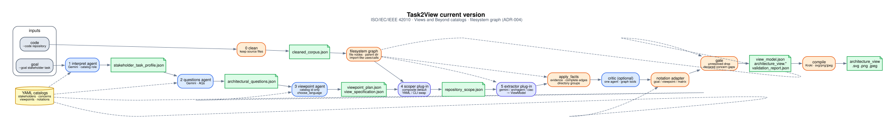

# Current pipeline



Two inputs: a code repository (`--code`) and a stakeholder goal (`--goal`). Output: one catalog viewpoint’s view (notation-neutral `ViewModel` + diagram).

Grounding: **ISO/IEC/IEEE 42010** (stakeholders, concerns, viewpoints, views) and **Views and Beyond** YAML under `code/src/task2view/knowledge/data/`.

## Stages

| Stage | Code | LLM? | What it consumes |
|---|---|---|---|
| 0 clean | `phase0/clean.py` | no | Repo files; keeps source, drops binaries |
| 1 interpret | `agents/phase1_interpret.py` | yes | Goal + stakeholder catalog |
| 2 questions | `agents/phase2_questions.py` | yes | Profile + required-information catalog |
| 3 viewpoint | `agents/phase3_viewpoint.py` | yes | Profile, questions, viewpoint catalog, task cues |
| spec + RI | `agents/orchestrate.py` | no | Instantiates `required_information.yaml` |
| graph | `phase3/graph.py` | no | uses / calls / parent directory among cleaned files |
| scoper | `phase3/` + `phase3/seeds.py` | no | Default `composite`. PageRank can force RI-matched files, then fill |
| extract | `phase4/extractors.py` | yes | Default `gemini`. `ciao` packs scoped files + vendored CIAO prompt |
| project | `agents/structure.py` | no | Directory groups, inter-package edges, view-type caps |
| critic | `agents/phase6_critic.py` | yes | Unanswered RI + missing neighbours. Cap 4 types. `--skip-critic` |
| gate + render | `phase4/validate.py`, `render.py` | no | Drops invented types; emits the chosen notation |
| compile | `phase4/compile.py` | no | Kroki (or local fallback) → SVG/PNG/JPEG |

Default orchestrator: `agents/orchestrate.py` `run_agentic`. Gemini agents on that path: interpret, questions, viewpoint, extractor, critic. They call `complete_json` only — no repository tool loop.

## Graph and projection

- Node = kept file (stem key; path aliases).
- Group = parent directory name (so a repo whose folders are `Entity` / `Boundary` / `Control` keeps those names because they **are** the directories).
- After extract, `ground_view_model` regroups, inserts graph edges according to `view_projection.yaml` (often inter-package only), and may add a context `system` node.

## Config

`code/pipeline.example.yaml` selects `scoper` / `extractor` / `diagram_language`. CLI flags override.

```bash
task2view run --code /path/to/repo --goal "As a tester, …" --out runs/demo
task2view run --code /path/to/repo --goal "…" --out runs/demo --config pipeline.example.yaml
```

## Architecture decisions

| ADR | Status |
|---|---|
| [ADR-001](adr/ADR-001-agentic-realignment.md) | accepted (extract D5–D7 superseded) |
| [ADR-002](adr/ADR-002-sota-plugins.md) | accepted |
| [ADR-003](adr/ADR-003-structure-grounding.md) | superseded in part by ADR-004 |
| [ADR-004](adr/ADR-004-filesystem-graph-and-config.md) | accepted |
