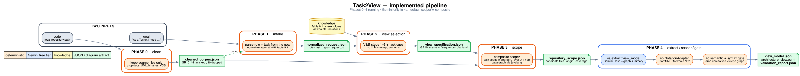
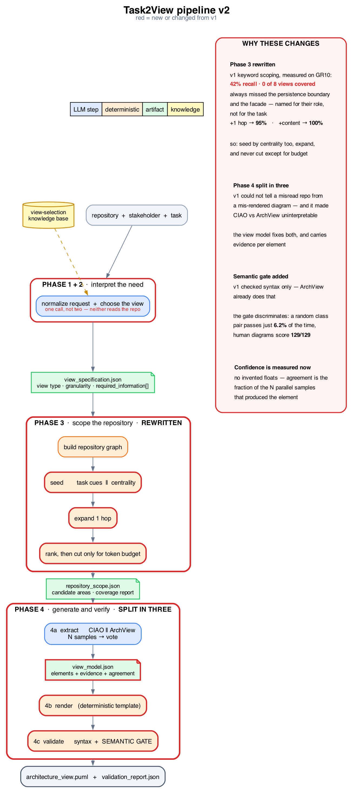
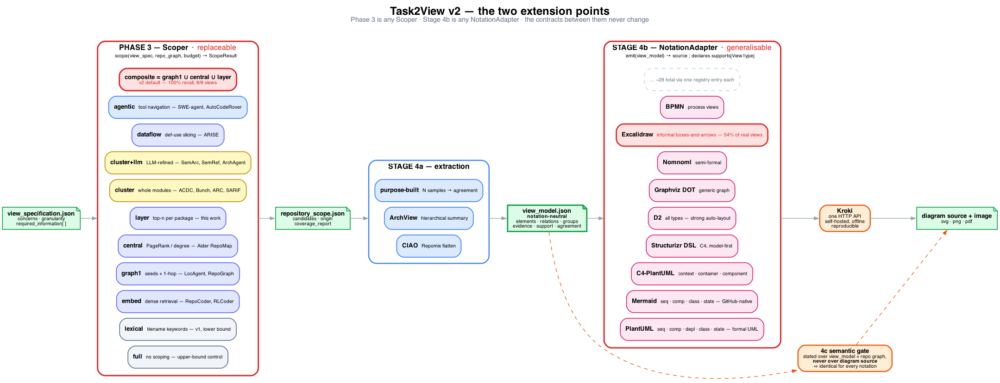
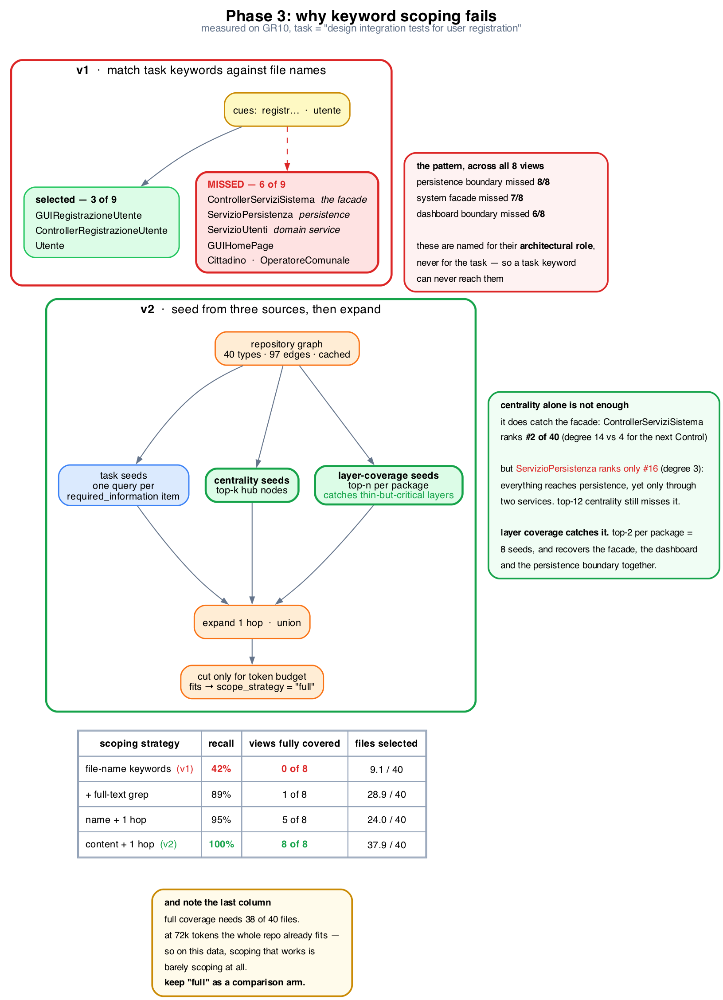

# Stakeholder- and Task-Guided Architecture View Generation

**Pipeline Specification v2** — revision of *Stakeholder_Task_Guided_Architecture_View_Generation_Pipeline.docx*
Research design draft, August 2026

---

## 0. What changed in v2, and why

v1 collapsed the earlier eight-phase design into four phases with explicit JSON contracts. That was the right move and v2 keeps it. The changes below address three problems found by measuring v1's assumptions against the GR10 data point (Section 12 gives the measurements).

| # | Change | Reason |
|---|---|---|
| 1 | Phase 3 scoping is rebuilt around **graph expansion and centrality**, not keyword matching | Keyword scoping as specified in v1 recovers **42%** of the elements a view needs, and fully covers **0 of 8** ground-truth views |
| 2 | `include_transitive_dependencies` default flipped to **depth 1** | One hop raises recall from 42% to 95% |
| 3 | Phase 3 gains **two task-independent seed sets** — centrality and layer coverage | Facades, persistence boundaries and dispatchers are named for their role, not the task, and were missed in 6–8 of 8 views. Centrality alone is not enough: the persistence boundary ranks only #16 of 40 |
| 4 | Phase 4 splits into **extraction → rendering → validation** with a `view_model.json` between them | v1 could not distinguish a misread repository from a mis-rendered diagram, which also made the CIAO-vs-ArchView comparison uninterpretable |
| 5 | Validation gains a **deterministic semantic gate** | v1's validation was syntax-only, which ArchView's Image Renderer already provides; it adds nothing new |
| 6 | Element-level **evidence fields** restored in the view model | v1 traced diagrams to files only, so faithfulness could not be measured per element |
| 7 | Explicit **parallel execution plan**, including N-sample agreement | Meeting feedback asked for parallelism; agreement across samples also supplies a *calculable* confidence, replacing the self-reported floats that were rejected |
| 8 | Scoping is declared an **evaluated question, not an assumption** | On repositories of this size scoping may be net harmful; the pipeline must be able to report that |
| 9 | Phase 3 is specified as a **`Scoper` interface with twelve interchangeable strategies**, not one algorithm | Strategies fail on different elements, so the choice must be measurable; SemRef shows a refinement layer over interchangeable SAR tools is the workable shape |
| 10 | The view model is **notation-neutral and view-type-neutral** (`elements`/`relations`/`groups`) | A schema with `participants` and `interactions` can only ever emit sequence diagrams |
| 11 | Stage 4b becomes a **`NotationAdapter` registry over Kroki**, ~9 notations declared with capabilities | ArchView measured that **54%** of real-world architecture views are informal boxes-and-arrows, not formal UML |
| 12 | Evaluation adopts **established SAR metrics** — MoJoFM, a2a, a2a_adj, c2c_cvg, ARI | These have published baselines across 10 recovery tools; inventing a metric makes results incomparable |

v2 keeps: the four-phase structure, JSON contracts between phases, `request_id` traceability, textual diagram source as the final artifact, and backend interchangeability.

**The organising idea of v2** is that the two phases carrying the most uncertainty — *which code to look at* and *how to draw it* — are the two that should be extension points. Both are defined by a contract with several implementations behind it, so that open questions become configuration sweeps instead of rewrites.

---

## 1. Design principles

1. **Contracts over agents.** A phase is defined by its input and output schema. Whether it is implemented as an LLM call, a deterministic function, or both is an implementation choice, not part of the specification.
2. **Deterministic where possible.** Anything checkable by parsing or graph lookup is not given to a model. Models are used for interpretation, selection, and abstraction.
3. **Recall-first scoping.** Completeness is the measured weak point of LLM view generation. Every scoping decision is biased toward including too much rather than too little, subject to an explicit token budget.
4. **Separate what is true from how it is drawn.** Architectural facts are extracted into a typed model; notation is applied afterwards.
5. **No unverifiable claims.** Every element and relation in a delivered view resolves either to a code entity or to an explicit "inferred" marker.
6. **Version-control-native output.** Textual diagram source is the deliverable; images are a downstream render.
7. **Uncertainty becomes an extension point.** Where the literature has no settled answer — scoping strategy, notation — the specification defines an interface and a catalog of implementations rather than picking one and hiding the choice.

---

## 2. Pipeline at a glance

| Phase | Name | Main question | Primary output |
|---|---|---|---|
| — | Inputs | What is supplied? | code repository + stakeholder goal |
| 0 | Repository Cleaning | Which files are source code? | `cleaned_corpus.json` |
| 1 | Request Intake and Normalization | What does the stakeholder want to accomplish? | `normalized_request.json` |
| 2 | View Need Identification | Which view does this goal need? | `view_specification.json` |
| 3 | Repository Scope Selection | Which cleaned files must be analyzed? | `repository_scope.json` |
| 4 | Targeted View Generation | How is the view produced and verified? | `view_model.json` + `architecture_view.*` + `validation_report.json` |

### Data flow

```
TWO INPUTS
  1. code   — local repository
  2. goal   — stakeholder goal statement
            |
            v
[Phase 0] Repository Cleaning ........... cleaned_corpus.json
            |   keep source files only; drop docs, binaries, UML, VCS
            v
[Phase 1] Request Intake ................. normalized_request.json
            |   parse role + task out of the goal
            v
[Phase 2] View Need Identification ....... view_specification.json
            |
            v
[Phase 3] Repository Scope Selection ..... repository_scope.json
            |   seed -> expand -> rank -> budget   (over the cleaned corpus)
            v
[Phase 4] Targeted View Generation
            |
            +-- 4a Architecture Extraction .... view_model.json
            +-- 4b Rendering .................. architecture_view.*
            +-- 4c Validation ................. validation_report.json
```

Diagrams: `diagrams/implemented_pipeline.png` (what the code runs today), `diagrams/pipeline_v2.png` (full v2 design), `diagrams/phase3_v1_vs_v2.png` (Section 6) and `diagrams/plugin_architecture.png` (below). Sources are Graphviz `.dot`, rendered to PNG, SVG and PDF.





### The two extension points

The fixed spine is four green artifacts. Everything red is a slot with a catalog behind it: Phase 3 is any `Scoper` (6.3), Stage 4b is any `NotationAdapter` (7.2). Neither can change the contract its neighbours see, which is what makes both an ablation axis rather than a fork.



### Execution shape

Phase 0 is deterministic and inspects only the filesystem. Phases 1 and 2 keep separate contracts for inspectability but **may be executed in a single model call**; neither reads file contents, so a second round trip buys nothing.

Phase 3 and Phase 4a are **map-reduce**, detailed in Section 9.

---

## 3. Running example

The example is a real repository with an independently authored UML model, so every claim below is checkable.

> **Input 1 — code** `progetto_ing_software_gr10` — a municipal citizen-report management system. Java 23, Maven, Swing GUI, MySQL via Hibernate/JPA. BCED layering (`Boundary`, `Control`, `Entity`, `Database`): 39 main-source files declaring 40 types, plus 5 test files. 11,775 lines and 72,054 tokens across main and test.
>
> **Input 2 — goal** "As a Tester, I need to understand how a user registration request is processed so I can design integration tests for it."
>
> **Ground truth** The project ships a Visual Paradigm model whose `Registrazione Utente - Pattern BCED` sequence diagram names 9 participating classes. All 9 exist in the code.

---

## 3.1 Inputs

The pipeline takes **exactly two inputs**. Everything else is derived.

| Input | What it is | What it is not |
|---|---|---|
| **code** | A local repository path | A file list, a flatten, or documentation |
| **goal** | One natural-language statement from a stakeholder: who they are and what they need to accomplish | A view type, a diagram notation, or a list of classes |

The goal is parsed in Phase 1. The expected shape is:

```
As a <role>, I need to <task>.
```

`<role>` is normalized against the Views and Beyond Table 9.1 rows. If the statement does not name a role, `--stakeholder` may be passed as an override. The pipeline does not ask the user which diagram to draw; that is Phase 2's job.

CLI:

```bash
task2view run \
  --code path/to/repo \
  --goal "As a Tester, I need to understand how a user registration request is processed so I can design integration tests for it." \
  --out runs/REQ-001
```

---

## 3.2 Phase 0 — Repository Cleaning

Runs **before** any interpretation of the goal and **before** any model sees the repository. It is a deterministic filesystem pass: keep source files, drop everything else. Downstream phases (3 and 4) are allowed to read only paths listed in `cleaned_corpus.json`.

This exists because student and industrial repos mix implementation with documentation, UML models, screenshots, translation tables, and binaries. Feeding those to an LLM is how diagrams get grounded in a `.vpp` or a README instead of in the code. CIAO's flatten has the same failure mode in reverse: its include list is language-specific and produced an empty corpus on Java.

### Contract

| Direction | Artifact | Description |
|---|---|---|
| In | code | Repository root |
| Out | `cleaned_corpus.json` | Kept source paths, dropped paths with reasons |

Kept: files whose extension is a programming language (see `code/src/task2view/knowledge/data/corpus.yaml`). Tests are source and are kept. Manifests (`pom.xml`), docs, images, Visual Paradigm models, PDFs, and VCS metadata are dropped and listed.

### Output (GR10)

44 Java files kept, everything else dropped (PNG, PDF, DOCX, MD, CSV, XML, VPP, `.form`).

### Validation

At least one source file kept; every kept path exists and is relative to the repository root.

---

## 4. Phase 1 — Request Intake and Normalization

Converts the goal statement into a stable machine-readable request. It does not choose a diagram and does not read source files (Phase 0 already listed them).

### Contract

| Direction | Artifact | Description |
|---|---|---|
| In | code | Local path (already cleaned in Phase 0) |
| In | goal | Stakeholder goal statement |
| Out | `normalized_request.json` | Input contract for Phase 2 |

### Output

```json
{
  "request_id": "REQ-001",
  "repository": { "name": "gr10", "location": "./data_points/...", "revision": "main" },
  "goal": "As a Tester, I need to understand how a user registration request is processed so I can design integration tests for it.",
  "stakeholder": { "role": "tester-and-integrator", "original_label": "Tester" },
  "task": { "description": "I need to understand how a user registration request is processed so I can design integration tests for it." },
  "preferences": { "diagram_language": "plantuml", "max_views": 1, "scope_token_budget": 120000 }
}
```

`scope_token_budget` is new in v2. It is the only thing that should force Phase 3 to drop candidates. When the whole repository fits inside it, Phase 3 must be allowed to return the whole repository.

### Validation

Repository resolvable; role present; task non-empty.

---

## 5. Phase 2 — View Need Identification

Translates the stakeholder-task pair into an architectural information need: which concerns matter, which view type answers them, at which granularity, and what specific information must be recoverable.

### Contract

| Direction | Artifact | Description |
|---|---|---|
| In | `normalized_request.json` | |
| In | View-selection knowledge | Stakeholder → concern → view-type → granularity mappings |
| Out | `view_specification.json` | Target view and the information it must convey |

### On the view-selection knowledge base

v1 left this as "architectural knowledge used by the agent," which is the least specified part of the pipeline and the one a reviewer will press on. It should be a concrete, inspectable table with one row per mapping:

```
stakeholder_role | concern | view_type | notation | granularity | required_information_template
```

Two existing assets seed it directly. CIAO's `prompt.json` already tags each documentation section with an SEI view type and a C4 level. ArchView's ground-truth annotations already carry concern, quality attribute and granularity codings over 340 repositories. Neither needs to be invented.

### Output

```json
{
  "request_id": "REQ-001",
  "stakeholder": "tester",
  "task_summary": "Design integration tests for user registration.",
  "architectural_concerns": ["runtime interaction", "control flow", "persistence boundary"],
  "selected_view": {
    "view_type": "sequence_view",
    "notation": "UML Sequence Diagram",
    "diagram_language": "plantuml",
    "granularity": "component_or_service_level",
    "purpose": "Show how a registration request propagates through the system in execution order."
  },
  "required_information": [
    { "id": "RI-1", "need": "entry point for registration requests" },
    { "id": "RI-2", "need": "orchestration/dispatch component" },
    { "id": "RI-3", "need": "user domain service" },
    { "id": "RI-4", "need": "persistence interaction" },
    { "id": "RI-5", "need": "ordered calls between participants" },
    { "id": "RI-6", "need": "observable validation and failure paths" }
  ]
}
```

`required_information` items are **identified** in v2 so that Phase 3 can report which item each selected file serves, and Phase 4c can report which items went unanswered.

`diagram_language` names an entry in the Stage 4b adapter registry (7.2) and is the only place notation is decided. It is part of the view specification rather than of Phase 4 because notation is a **stakeholder-fit question**, not a rendering detail: a tester reading execution order and a product owner reading a system context sketch want different notations from the same repository. Choosing it here also means the same `view_model.json` can be re-rendered in another notation without re-running extraction.

### Validation

View type, concern, granularity present; at least one `required_information` item; every item has a stable id; `diagram_language` is registered **and declares support for `view_type`** (7.2).

---

## 6. Phase 3 — Repository Scope Selection

**This phase is rewritten. The v1 specification does not work.**



### 6.1 Why v1 fails

v1 specifies deriving search cues from the task ("login, auth, security, token, controller, route") and matching them against repository structure and file names. Measured on the 8 BCED sequence diagrams of the running-example repository, against participant sets known to exist in the code:

| Strategy | Participant recall | Views fully covered | Files selected |
|---|---|---|---|
| File-name keyword match (v1 as written) | **42%** | **0 / 8** | 9.1 / 40 |
| Name + 1 hop on the call graph | 95% | 5 / 8 | 24.0 / 40 |
| Name + full-text grep | 89% | 1 / 8 | 28.9 / 40 |
| Content + 1 hop | **100%** | **8 / 8** | 37.9 / 40 |

The failures are systematic rather than random. Across the 8 views, the persistence service was missed every time, the system facade 7 times, and the dashboard boundary 6 times. Task keywords match classes named after the *task*; they cannot match classes named after their *architectural role*. Scoping by task keyword therefore discards precisely the elements that distinguish an architecture view from a feature slice.

A missed participant is unrecoverable downstream, because v1 sets `include_transitive_dependencies: false`.

### 6.2 Position in the literature

Two distinct research communities have already solved parts of this problem, and the pipeline should borrow from both rather than invent a third approach.

**(a) Repository-level code localization** — "given a stated need, which code is relevant?" Developed for program repair, directly transferable.

| Approach | Mechanism | Reported result |
|---|---|---|
| Agentless | fixed hierarchical localize → generate → validate | matches tool-driven agents at lower cost |
| LocAgent | heterogeneous file/class/function graph + traversal tools | 92.7% file-level accuracy, SWE-bench Lite |
| RepoGraph | line-level reference graph as an agent plugin | ~+2 pp resolve rate over SWE-agent |
| CodexGraph | repository in Neo4j, agent-issued Cypher | — |
| Aider RepoMap | tree-sitter graph ranked by PageRank | — |
| OrcaLoca | priority scheduling, distance-aware context pruning | 65.3% function match, SWE-bench Lite |
| RepoUnderstander | hierarchical + call graph, MCTS exploration | — |
| ARISE (2026) | intra-procedural def-use edges, data-flow slicing as a tool | +17.0 Function Recall@1 over SWE-agent |
| RepoCoder / RLCoder / GraphCoder | iterative and learned retrieval | — |

The consistent finding is that **structural traversal outperforms lexical retrieval**, which is exactly the 42% → 95% jump measured in 6.1.

**(b) Software architecture recovery (SAR)** — "what are this system's components?" This is the older field and the pipeline document does not currently acknowledge it, which is a gap a reviewer will notice immediately.

| Approach | Mechanism |
|---|---|
| ACDC | comprehension-driven clustering over structural dependencies |
| Bunch | search-based clustering, modularization quality |
| ARC | concern-based recovery via topic modelling |
| FCA | formal concept analysis on dependencies |
| SADE / SARIF / EVOL / ZBR | hybrid dependency + textual clustering |
| SemArc (TSE 2025) | LLM semantics + canonical patterns + component-as-anchor clustering; +32 pp over 7 baselines |
| SemRef (ICSE 2026) | LLM refinement layer *on top of* existing SAR tools; +17.7–43.4% over 10 tools |
| ArchAgent (2026) | static analysis + adaptive grouping + LLM synthesis; emits Mermaid; F1 0.966 vs DeepWiki 0.860 |

SAR contributes something localization does not: **a decomposition into modules**. That matters here for two reasons. First, scoping at cluster granularity rather than file granularity preserves architectural coherence — the failure in 6.1 is precisely what happens when a component is split and only the task-named half is selected. Second, the recovered clustering supplies the *granularity* that Phase 2 requests and Phase 4 must respect, which is the exact axis on which ArchView reported endemic mismatch.

SemRef is the most directly instructive: it is a refinement layer over interchangeable underlying tools, showing no significant preference for which tool it refines. That is the same plug-in shape adopted below.

### 6.3 The Scoper interface

Phase 3 is defined as an **interface with interchangeable implementations**, not a fixed algorithm. Every strategy consumes and produces the same contract, so strategies are swappable at configuration time and directly comparable in an ablation.

```python
class Scoper(Protocol):
    name: str
    requires: set[str]          # e.g. {"graph"}, {"embeddings"}, {"llm"}

    def scope(
        self,
        view_spec: ViewSpecification,   # concerns, granularity, required_information[]
        repo: RepositoryGraph,          # cached, per commit
        budget: TokenBudget,
    ) -> ScopeResult: ...               # ranked candidates + coverage_report + rationale
```

`ScopeResult` is exactly the `repository_scope.json` of 6.5. Because `origin` is recorded per candidate, a composite strategy remains decomposable in the logs.

**Strategy catalog.** Each is an independently runnable configuration and an ablation arm.

| id | Strategy | Basis | Role in the study |
|---|---|---|---|
| `full` | no scoping, whole repository | — | **upper-bound control** |
| `lexical` | file-name keyword match | v1 as written | **lower-bound control** |
| `grep` | full-text keyword match | v1 + content | baseline |
| `embed` | dense retrieval over chunk embeddings | RepoCoder, RLCoder | baseline |
| `graph1` | seeds + 1-hop traversal | LocAgent, RepoGraph | primary |
| `central` | centrality ranking | Aider RepoMap | primary |
| `layer` | top-n per package/layer | *this work* | primary |
| `cluster` | select whole recovered modules | ACDC, Bunch, ARC, SARIF | granularity-preserving |
| `cluster+llm` | LLM-refined clustering | SemArc, SemRef | granularity-preserving |
| `dataflow` | def-use slicing from seeds | ARISE | behavioural views |
| `agentic` | LLM navigates with tools | SWE-agent, AutoCodeRover, Moatless | upper-bound LLM |
| `composite` | `graph1 ∪ central ∪ layer` | — | **v2 default** |

Two properties make this worth specifying as an interface rather than a procedure. The strategies fail on *different* elements — 6.1 shows lexical missing role-named classes while centrality misses thin layers — so union is a real gain, not redundancy. And `full` versus `composite` is the experiment that decides whether Phase 3 belongs in the pipeline at all.

### 6.4 Procedure (the `composite` default)

Phase 3 runs four stages. Stages 1–3 produce a ranked candidate set; stage 4 is the only place where anything is discarded.

**Stage 1 — Build the repository graph (deterministic, cached per revision).**
Parse the repository into a typed graph: nodes for files, packages, types and methods; edges for imports, calls, inheritance, implementation, field typing and instantiation. Cache per commit. This is a parser pass, not a model call. Language support is a real constraint and must be recorded in the run log — for Java, note that parsers predating Java 16 fail on pattern-matching `instanceof`, which silently dropped 3 of 39 files in our first run.

**Stage 2 — Seed, from three independent sources.** All three run in parallel and are unioned.

- *Task seeds*: for each `required_information` item, locate candidate nodes by symbol and identifier search, path and file-name match, and configuration/manifest inspection. One query per item.
- *Centrality seeds*: rank all nodes by graph centrality and take the top-k regardless of the task. In the running example this recovers the system facade `ControllerServiziSistema`, which ranks #2 of 40 with degree 14 against 4 for the next-highest Control class.
- *Layer-coverage seeds*: take the top-n nodes of each package or architectural layer. This is not redundant with centrality — see below.

Centrality alone is insufficient, and the running example shows why concretely. The persistence boundary `ServizioPersistenza` ranks only **#16 of 40** with degree 3: everything in the system eventually reaches persistence, but only through two service classes, so its degree is low. Top-12 centrality still misses it. Layer coverage catches it immediately, because the `Database` package contains only two types. Top-2 per layer is 8 seed nodes total and recovers the facade, the dashboard boundary and the persistence boundary together — precisely the three classes that keyword scoping missed in 6 to 8 of the 8 views.

The general lesson is that architectural significance has at least two distinct shapes: **hubs**, which centrality finds, and **thin mandatory layers**, which it does not.

**Stage 3 — Expand.**
Take the transitive closure of the seed set to **depth 1** by default over call, inheritance and typing edges. Depth is a configuration parameter and an ablation axis.

**Stage 4 — Rank and budget.**
Score each candidate by which `required_information` items it serves, seed proximity, and centrality. Include candidates in score order until `scope_token_budget` is reached. **If the whole repository fits within budget, select the whole repository and record `scope_strategy: "full"`.** A pipeline that narrows a 72k-token repository to fit a 400k-token budget is paying a recall cost for nothing.

### 6.5 Output

```json
{
  "request_id": "REQ-001",
  "target_view": "sequence_view",
  "scope_strategy": "composite",
  "graph": { "nodes": 40, "edges": 97, "parse_failures": [] },
  "candidate_areas": [
    { "path": "src/main/java/Boundary/GUIRegistrazioneUtente.java",
      "serves": ["RI-1"], "origin": "task_seed", "score": 0.94,
      "reason": "Registration boundary; entry point for the flow." },
    { "path": "src/main/java/Control/ControllerServiziSistema.java",
      "serves": ["RI-2"], "origin": "centrality_seed", "score": 0.91,
      "reason": "Highest-centrality Control node; dispatches all use cases." },
    { "path": "src/main/java/Entity/ServizioUtenti.java",
      "serves": ["RI-3"], "origin": "expansion_1hop", "score": 0.88,
      "reason": "Called by the registration controller." },
    { "path": "src/main/java/Database/ServizioPersistenza.java",
      "serves": ["RI-4"], "origin": "centrality_seed", "score": 0.85,
      "reason": "Sole persistence boundary; not task-named." }
  ],
  "scope_constraints": {
    "expansion_depth": 1,
    "token_budget": 120000,
    "tokens_selected": 61240,
    "budget_forced_exclusions": 0
  },
  "coverage_report": {
    "required_information_served": ["RI-1", "RI-2", "RI-3", "RI-4", "RI-5"],
    "required_information_unserved": ["RI-6"]
  }
}
```

`origin` and `coverage_report` are new. `origin` makes the ablation directly readable from the artifact. `coverage_report` surfaces an unserved information need *before* generation, which is the earliest point at which the pipeline can honestly say a view will be partial.

### 6.6 Validation

Paths exist; scope non-empty; `tokens_selected` ≤ budget; every `required_information` item either served or explicitly listed as unserved. Validation is defined on the contract, not the strategy, so it applies unchanged to every plug-in.

### 6.7 Open question

Whether task-guided scoping helps or harms view quality is **an experimental question this pipeline must be able to answer**, not an assumption. The Scoper interface exists so that this is a configuration sweep rather than a rewrite: `full` versus `composite` versus each single strategy, on the same requests, scored by the Phase 4c gate. On repositories that fit in context, the honest expected result is that scoping does not help.

---

## 7. Phase 4 — Targeted View Generation

Phase 4 is one phase with three stages and two artifacts between them. The split exists because a wrong diagram has at least three distinct causes — wrong scope, misread code, bad rendering — and v1 could not tell them apart.

### 7.1 Stage 4a — Architecture extraction

Reads the scoped repository content and produces a typed `view_model.json`. No notation is applied here.

**Inputs** `view_specification.json`, `repository_scope.json`, resolved file contents, generation configuration.

```json
{
  "request_id": "REQ-001",
  "backend": "ciao",
  "model": "<configured-llm>",
  "samples": 5,
  "generation_policy": {
    "use_only_scoped_repository_content": true,
    "forbid_unsupported_elements": true,
    "require_evidence_per_element": true
  }
}
```

**Output** `view_model.json` — a **notation-neutral, view-type-neutral** typed graph. It is deliberately *not* a sequence-diagram schema: a schema with `participants` and `interactions` can only ever emit sequence diagrams, which would hard-wire the limitation 7.2 exists to remove. Three collections cover every view type the pipeline targets: `elements` (nodes), `relations` (edges, optionally ordered), `groups` (nesting — packages, layers, deployment nodes, C4 boundaries).

```json
{
  "request_id": "REQ-001",
  "view_type": "sequence_view",
  "granularity": "component_or_service_level",
  "groups": [
    { "id": "G1", "name": "Boundary", "kind": "layer", "contains": ["E1"] },
    { "id": "G2", "name": "Control",  "kind": "layer", "contains": ["E2"] },
    { "id": "G3", "name": "Entity",   "kind": "layer", "contains": ["E3"] }
  ],
  "elements": [
    { "id": "E0", "name": "User", "kind": "actor", "external": true,
      "evidence": null, "support": "inferred", "agreement": 1.0 },
    { "id": "E1", "name": "GUIRegistrazioneUtente", "kind": "component", "role": "boundary",
      "evidence": { "file": "src/main/java/Boundary/GUIRegistrazioneUtente.java", "symbol": "GUIRegistrazioneUtente" },
      "support": "observed", "agreement": 1.0 },
    { "id": "E2", "name": "ControllerServiziSistema", "kind": "component", "role": "control",
      "evidence": { "file": "src/main/java/Control/ControllerServiziSistema.java", "symbol": "ControllerServiziSistema" },
      "support": "observed", "agreement": 1.0 },
    { "id": "E3", "name": "ServizioUtenti", "kind": "component", "role": "service",
      "evidence": { "file": "src/main/java/Entity/ServizioUtenti.java", "symbol": "ServizioUtenti" },
      "support": "observed", "agreement": 0.8 }
  ],
  "relations": [
    { "id": "R1", "from": "E1", "to": "E2", "kind": "call",
      "label": "registerUser(data)", "order": 1,
      "evidence": { "file": "src/main/java/Boundary/GUIRegistrazioneUtente.java", "symbol": "onSubmit", "excerpt": "servizi.registraUtente(dati)" },
      "support": "observed", "agreement": 1.0 }
  ],
  "unanswered": ["RI-6"],
  "notes": ["Failure paths are not observable in the scoped content."]
}
```

Vocabularies are closed and validated. `element.kind` ∈ {actor, component, class, service, datastore, external_system, deployment_node, state}; `relation.kind` ∈ {call, return, depends, dataflow, inherits, implements, contains, deploys, transition}; `group.kind` ∈ {layer, package, boundary, node, subsystem}.

The remaining fields carry the design intent. `evidence` restores element-level traceability that v1 dropped. `support` is `observed` or `inferred` — no numeric confidence is invented. `agreement` is the fraction of the N parallel samples that produced this element, a measured quantity rather than a model's self-report. `order` is present only for behavioural views and is what lets one schema serve both structural and behavioural output.

**Backends.** CIAO and ArchView both plug in here, and only here. The CIAO route converts `repository_scope.json` into Repomix include rules and rewrites the section prompt into a single view-extraction prompt. The ArchView route restricts its summarizer and Prompt Builder to the same scope. Because both must emit the same `view_model.json`, they become genuinely comparable — v1 compared final diagrams, which confounds extraction quality with rendering quality.

*Note:* CIAO's current `repomix.config.json` includes only Python, HTML, CSS, JS and notebook files and excludes tests. It produces an empty flatten on Java repositories and must be fixed before the CIAO route can run at all.

### 7.2 Stage 4b — Rendering

Rendering is **deterministic template application** from `view_model.json` to a diagram source, then to an image. No model call is involved, and a deterministic renderer cannot hallucinate an element.

Committing to PlantUML alone would be a mistake, and ArchView's own evaluation is the evidence: it found that **54% of architecture views practitioners actually publish are informal boxes-and-arrows**, not formal UML, and named the formal/informal gap as the limit on practical applicability. A pipeline whose stated purpose is to serve *stakeholders* cannot emit only the notation that a bare majority of its stakeholders do not use.

**The adapter registry.** Rendering is therefore split into two interchangeable layers.

```python
class NotationAdapter(Protocol):
    id: str                          # "plantuml", "mermaid", "d2", ...
    supports: set[ViewType]          # declared capability
    formats: set[str]                # {"svg", "png", "pdf"}

    def emit(self, vm: ViewModel) -> str: ...   # view model -> diagram source
```

Sources are then rasterised through a single renderer. **Kroki** is the right choice here: one HTTP API (`POST {diagram_source, diagram_type, output_format}`) fronting ~28 diagram languages, self-hostable via Docker so evaluation runs are reproducible and offline. Adding a notation becomes an adapter plus a registry entry, with no change to Phases 1–3 or to Stage 4a.

**Notation capability matrix.** Not every notation can express every view, so the registry declares capability and Phase 2 may only select a supported pair. This is a validation rule, not a convention.

| Notation | Sequence | Component | Deployment | Class | State | Dataflow | Register |
|---|:--:|:--:|:--:|:--:|:--:|:--:|---|
| PlantUML | ✓ | ✓ | ✓ | ✓ | ✓ | ✓ | formal UML |
| Mermaid | ✓ | ✓ | — | ✓ | ✓ | ✓ | web-native, GitHub-rendered |
| C4-PlantUML | — | ✓ | ✓ | — | — | — | C4 L1–L3 |
| Structurizr DSL | ✓ | ✓ | ✓ | — | — | — | C4, model-first |
| D2 | ✓ | ✓ | ✓ | ✓ | ✓ | ✓ | modern, strong auto-layout |
| Graphviz DOT | — | ✓ | ✓ | ✓ | ✓ | ✓ | generic graph |
| Nomnoml | — | ✓ | — | ✓ | — | — | semi-formal |
| Excalidraw | — | ✓ | ✓ | — | — | ✓ | **informal, hand-drawn** |
| BPMN | — | — | — | — | — | ✓ | process views |

`elements`/`relations`/`groups` map onto each of these without loss; only `order` and `groups` are notation-sensitive, and an adapter that cannot express them must declare so rather than silently drop them.

**Output** `architecture_view.{ext}` plus the rendered image. The same `view_model.json` above, through two adapters:

```
@startuml
actor User as E0
participant "GUIRegistrazioneUtente" as E1
participant "ControllerServiziSistema" as E2
participant "ServizioUtenti" as E3

E0 -> E1: submit registration
E1 -> E2: registerUser(data)
E2 -> E3: createUser(data)
@enduml
```

```
direction: right
Boundary: { E1: GUIRegistrazioneUtente }
Control:  { E2: ControllerServiziSistema }
Entity:   { E3: ServizioUtenti }

Boundary.E1 -> Control.E2: registerUser(data)
Control.E2 -> Entity.E3: createUser(data)
```

Two consequences worth stating. Notation becomes an **ablation axis** — the same view model rendered five ways, scored for stakeholder comprehension, is a publishable result and directly answers ArchView's open question. And because notation choice no longer touches extraction, a notation failure can never be mistaken for an extraction failure, which is the separation-of-causes argument that motivated splitting Phase 4 in the first place.

### 7.3 Stage 4c — Validation

Two gates. The syntactic gate is what ArchView's Image Renderer already does; the semantic gate is what v1 lacked.

**Syntactic gate.** Compile the diagram source. On failure, return source plus compiler error to the renderer, bounded at 3 attempts.

**Semantic gate** — deterministic, no model involved:

| Check | Rule |
|---|---|
| Element resolution | every non-`external` element resolves to a type in the repository graph |
| Relation resolution | every `call`/`depends`/`inherits` relation corresponds to an edge in the graph |
| Scope conformance | every evidence path appears in `repository_scope.json` |
| Granularity conformance | no element below the requested granularity |
| Evidence completeness | every `observed` element carries a resolvable `file` and `symbol` |
| Coverage | every `required_information` item is answered or listed in `unanswered` |
| Notation capability | the selected adapter declares support for `view_type`; `order`/`groups` not silently dropped |

Every check is stated over `view_model.json` and the repository graph, never over diagram source, so the gate is identical for all notations.

This gate is discriminative rather than decorative: on the running-example repository, only 6.2% of the 1,560 ordered class pairs satisfy the interaction-resolution check, so passing it is informative. Applied to the human-authored ground-truth diagrams it returns 129 of 129 relations confirmed, which is the calibration baseline a generated view is measured against.

**Output** `validation_report.json`:

```json
{
  "request_id": "REQ-001",
  "notation": "plantuml",
  "syntax": { "status": "pass", "attempts": 1 },
  "semantic": {
    "elements_resolved": "5/5",
    "relations_resolved": "7/8",
    "unsupported": [ { "from": "E2", "to": "E4", "label": "sendEmail()", "reason": "no edge in repository graph" } ],
    "granularity_violations": [],
    "unanswered_information": ["RI-6"]
  },
  "verdict": "pass_with_corrections"
}
```

Unsupported elements are **removed and reported**, not silently kept.

---

## 8. Confidence

v1 removed the self-reported confidence floats of the earlier design, correctly — they were uncalibrated and drew direct criticism. v2 does not reintroduce them. The only confidence-like quantity is `agreement`: run 4a N times in parallel and record, per element, the fraction of samples containing it. It is reproducible, cheap given that the samples are already parallel, and it means something specific.

Elements below an agreement threshold are marked rather than dropped, so that the threshold remains an evaluable parameter.

---

## 9. Parallel execution plan

| Stage | Parallel over | Reduce | Notes |
|---|---|---|---|
| 1 + 2 | — | — | Merge into one call; no repository access |
| 3 stage 1 | files | graph union | Deterministic parse; cache per commit |
| 3 stage 2 | `required_information` items × strategies | **union** | Union is correct: recall is the weak axis |
| 3 stage 3 | seed nodes | set union | Graph traversal |
| 4a | N samples | **vote on canonical elements** | Yields `agreement` |
| 4b | — | — | Deterministic |
| 4c | checks | conjunction | All checks independent |

**Barriers** are the graph build (stage 1 must finish before stage 3) and the 4a vote.

**The vote is the hard part.** Parallel samples emit `ServizioUtenti`, `Servizio Utenti` and `UserService` as three participants unless names are canonicalized before merging. Entity resolution at the reduce step must be specified before implementation: normalize case, whitespace and accents, then resolve against the repository graph, and treat two elements as identical when they resolve to the same node. Elements that resolve to no node are exactly the ones the semantic gate will reject.

Running CIAO and ArchView concurrently is an experiment axis, not a runtime optimization.

---

## 10. Interface summary

| Phase | Consumes | Produces | Format | Key validation |
|---|---|---|---|---|
| 0 | code | Cleaned corpus | JSON | ≥1 source file; paths relative to repo |
| 1 | code + goal | Normalized request | JSON | Repo resolvable; role and task present |
| 2 | Normalized request | View specification | JSON | View type, concern, granularity, identified information needs |
| 3 | View spec + cleaned corpus | Repository scope | JSON | Paths exist in the cleaned corpus; within budget; coverage reported |
| 4a | View spec + scope + files | View model | JSON | Every element carries resolvable evidence |
| 4b | View model | Diagram source + image | any registered notation | Deterministic template; capability declared |
| 4c | View model + diagram + graph | Validation report | JSON | Syntax valid; elements resolve; granularity respected |

Two of these are extension points rather than fixed components. Phase 3 is any `Scoper` (6.3) and Stage 4b is any `NotationAdapter` (7.2); both are selected by configuration, and neither can change the contract its neighbours see.

---

## 11. Implementation rules

1. Validate every artifact against a JSON Schema before passing it on.
2. Carry `request_id` through every artifact and log line.
3. Keep repository paths relative to the repository root.
4. Reference file contents by path; do not embed sources in intermediate JSON.
5. Cache the repository graph per commit; it is reused across requests and stages.
6. Make `repository_scope.json` human-inspectable and editable before Phase 4.
7. Log backend, model, sample count, expansion depth and scope strategy on every run — these are the ablation axes.
8. Record parser failures explicitly; a silently unparsed file is a silently missing architecture element.
9. Store diagram source even when an image is rendered.
10. Never let Phase 4 emit an element the semantic gate cannot resolve.

---

## 12. Measured evidence behind v2

All figures from `progetto_ing_software_gr10`, Italian original, using `tools/vpp_extract.py`, `tools/java_facts.py`, `tools/compare_gr10.py` and `tools/phase3_recall.py`.

| Measurement | Value |
|---|---|
| Repository size | 39 main files / 40 types (+5 test files); 11,775 lines; 72,054 tokens |
| Repository graph | 40 nodes, 97 directed uses-edges |
| Ground-truth model | 55 diagrams; 9 sequence diagrams at code level, 18 at analysis level |
| Ground-truth relations verified against code | **129 / 129 confirmed, 0 contradicted** |
| Random-pair control for the resolution check | 6.2% of 1,560 ordered class pairs |
| Diagram coverage of code call edges | 43 / 62 = **69%** |
| v1 keyword scoping recall | **42%**, 0 / 8 views fully covered |
| Scoping with 1-hop expansion | 95%, 5 / 8 views |
| Content + 1-hop expansion | 100%, 8 / 8 views, 37.9 / 40 files |
| Rank of the system facade by degree centrality | #2 of 40 (degree 14; next Control class is 4) |
| Rank of the persistence boundary by degree centrality | **#16 of 40** (degree 3) — missed by top-12 |
| Layer coverage, top-2 per package | 8 seeds; recovers facade, dashboard and persistence boundary |

Two consequences for evaluation. First, the ground truth is **incomplete at 69%**, so precision and recall against it are not symmetric: an element present in the code but absent from the human diagram is an abstraction-quality signal, not a hallucination, and must not be scored as one. Second, the ground truth is **stratified** — pooling the 18 analysis-level diagrams with the 9 code-level ones introduces phantom false negatives from candidate classes that were correctly discarded during design.

---

## 13. Evaluation metrics

The pipeline should not invent its own scoring. The architecture-recovery community has standard metrics with published baselines, and using them makes results comparable rather than self-referential.

| Layer | Metric | Source |
|---|---|---|
| Phase 3 scoping | recall of ground-truth elements, tokens selected, views fully covered | this work (6.1) |
| Phase 4a decomposition | **MoJoFM**, **a2a**, **a2a_adj**, **c2c_cvg**, **ARI** | Wen & Tzerpos; Le et al.; Zhang et al. — the five used by SemRef |
| Phase 4a view content | per-category TP/FP/FN over **layers, nodes, edges** → precision/recall/F1 | ArchAgent's protocol |
| Phase 4c grounding | element and relation resolution rate against the repository graph | this work (7.3) |
| Phase 4b notation | comprehension and task-completion time per notation | ArchView's open question |

Two cautions specific to this data. MoJoFM and a2a assume a partition of *all* files, so they apply to whole-repository decomposition, not to a task-scoped view; scope-restricted variants must be reported as such. And a2a has a known narrow dynamic range — SemRef measured it above 0.7 even for poor architectures — so it should never be reported alone.

---

## 14. Open decisions

1. **Does scoping help?** Run `full` against `composite` on the same requests and compare view quality. If scoping does not help at this repository size, say so and reposition the contribution.
2. **Expansion depth.** Depth 1 recovered 95%. Depth 2 is untested and will approach whole-repository selection.
3. **Which backend at 4a**, or whether a purpose-built extractor beats both.
4. **Agreement threshold** for marking low-agreement elements.
5. **Stakeholder coverage.** Deployment and security views cannot be grounded in either data point — no Dockerfile, no CI, no IaC, no API specification. The realistic stakeholder set for this study is developer, tester and maintainer.
6. **Which notations to ship first.** The matrix in 7.2 lists nine; a credible first release is PlantUML (formal baseline), Mermaid (web-native), and one informal notation — Excalidraw or D2 — to test ArchView's 54% finding. The rest are registry entries, not roadmap items.
7. **Does notation affect comprehension?** Untested by anyone. The adapter registry makes it a controlled experiment on a fixed view model, which is the strongest reason to build Stage 4b this way.
